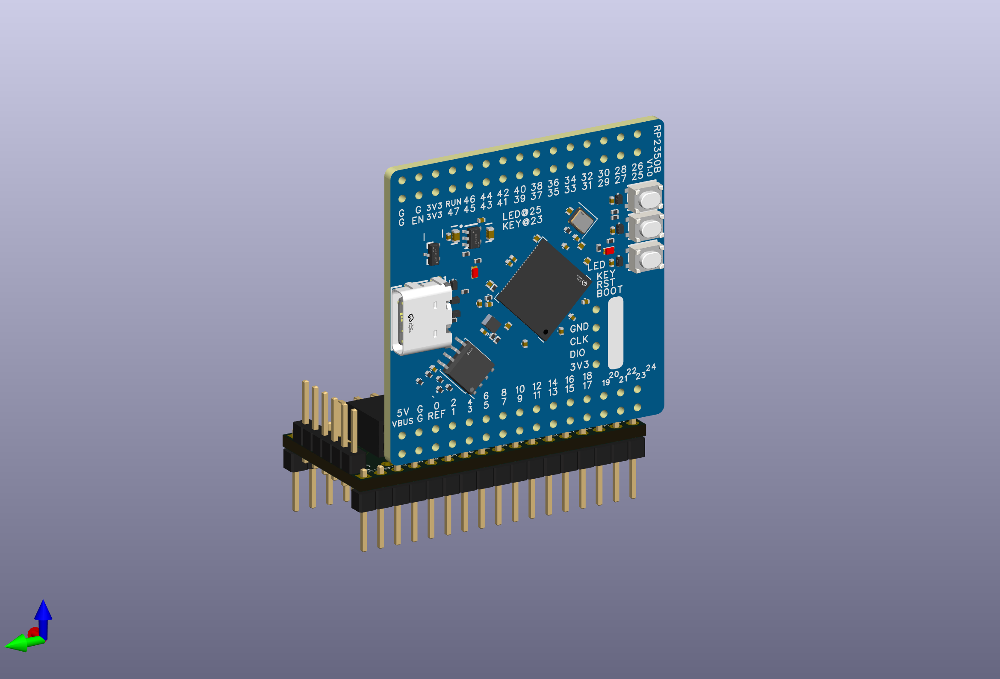
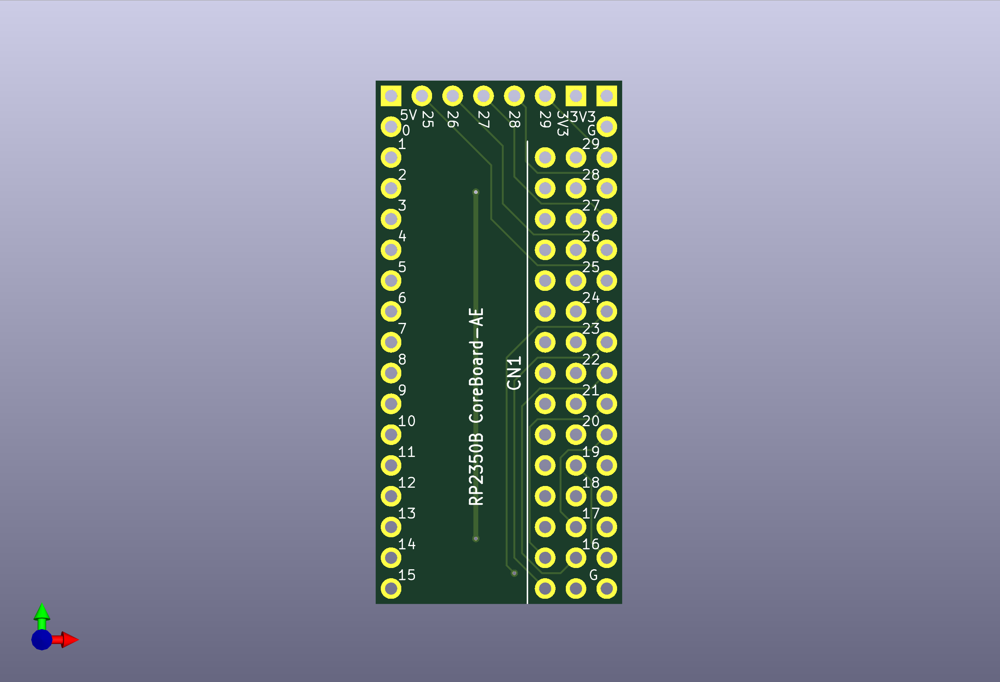
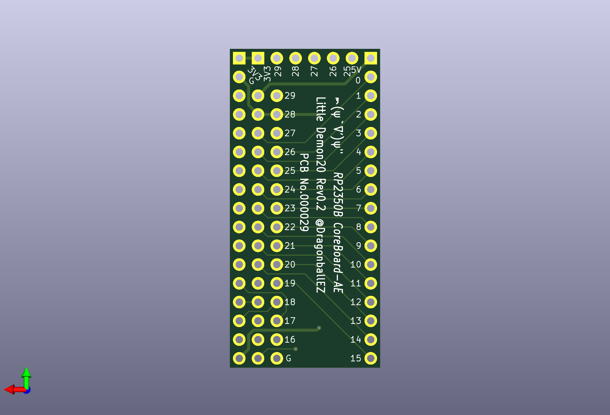
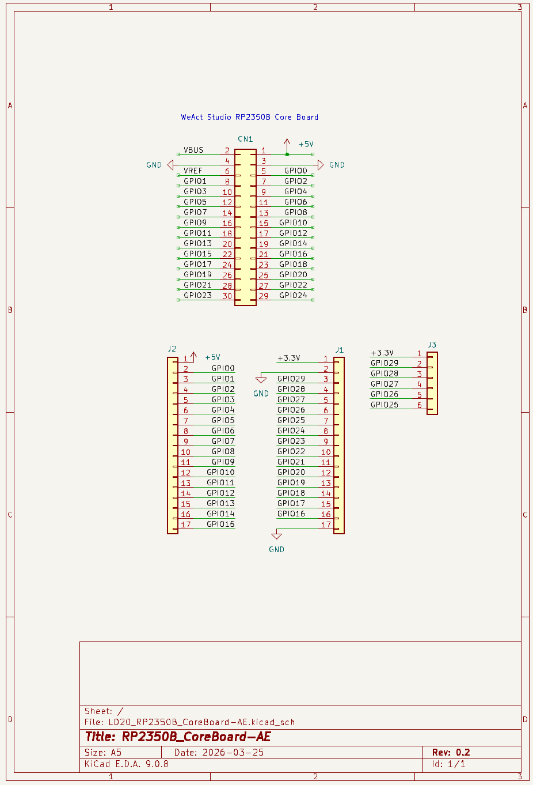
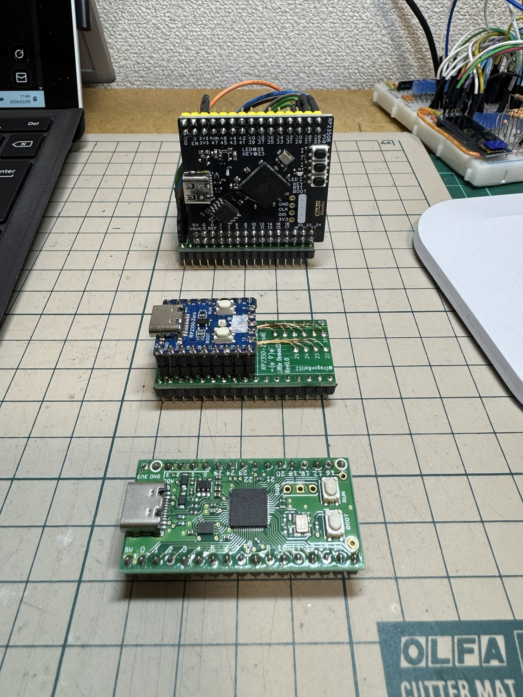

# RP2350B_CoreBoard-AE_PCB
RP2350B CoreBoard の ピン配置を AE-RP2040 互換にする変換基板

## 部品

- 30p (2×15) L字型ピンソケット　×1
- 連結ソケット 又は ピンヘッダー (1×17)　×2
- ピンヘッダー 6p　×1

## 組み立て

参考: [RP2350B CoreBoard-AEの組み立て方AE-RP2040互換ピンコネ変換基板](https://note.com/quiet_duck4046/n/n86c9b04b3479)

## イメージ・回路図

